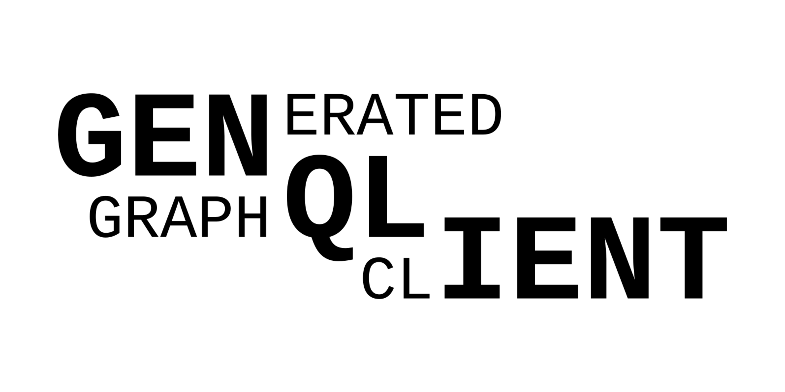

# genqlient: a truly type-safe Go GraphQL client

This is a proof-of-concept of using code-generation to create a truly type-safe GraphQL client in Go.  It is certainly not ready for production use nor for contributions (see [docs/CONTRIBUTING.md](docs/CONTRIBUTING.md)).

## Why another GraphQL client?

To understand the issue, consider the example from the documentation of [shurcooL/graphql](https://github.com/shurcooL/graphql/):
```go
// to send a query `{ me { name } }`:
var query struct {
	Me struct {
		Name graphql.String
	}
}
// error handling omitted for brevity
client.Query(context.Background(), &query, nil)
fmt.Println(query.Me.Name)
// Output: Luke Skywalker
```
While this code may seem type-safe, and at the Go level it is, there's nothing to check that the schema looks like you expect it to.  In fact, perhaps here we're querying the GitHub API, in which the field is called `viewer`, not `me`, so this query will fail.  More common than misusing the name of the field is mis-capitalizing it, since Go and GraphQL have somewhat different conventions there.  And even if you get it right, it adds up to a lot of handwritten boilerplate!  And that's the best case; other clients, such as [machinebox/graphql](https://github.com/machinebox/graphql), have even fewer guardrails to help you make the right query and use the result correctly.  This isn't a big deal in a small application, but for serious production-grade tools it's not ideal.

These problems should be entirely avoidable: GraphQL and Go are both typed languages; and GraphQL servers expose their schema in a standard, machine-readable format.  We should be able to simply write a query `{ viewer { name } }`, have that automatically validated against the schema and turned into a Go struct which we can use in our code.  In fact, there's already good prior art to do this sort of thing: [99designs/gqlgen](https://github.com/99designs/gqlgen) is a popular server library that generates types, and Apollo has a [codegen tool](https://www.apollographql.com/docs/devtools/cli/#supported-commands) to generate similar client-types for several other languages.  (See [docs/DESIGN.md](docs/DESIGN.md) for more prior art.)

This is a GraphQL client that does the same sort of thing: you specify the query, and it generates type-safe helpers that make your query.

## Usage

### Example

To use genqlient, put your GraphQL schema (in [SDL format](https://www.apollographql.com/blog/three-ways-to-represent-your-graphql-schema-a41f4175100d/#0c31)) in a file `schema.graphql`, and put a query like the following in `queries.graphql`:

```graphql
# queries.graphql
query getViewer {
  viewer {
    name
  }
}
```

Then run genqlient (`go run github.com/Khan/genqlient`), and it will generate:

```go
// generated.go (auto-generated):
type getViewerResponse struct { ... }
func getViewer(ctx context.Context, client *graphql.Client) (*getViewerResponse, error) { ... }
```

Finally, write your code to call genqlient, like so:

```go
// your code (error handling omitted for brevity)
graphqlClient := graphql.NewClient("https://example.com/graphql", nil)
viewerResp, _ := getViewer(context.Background(), graphqlClient)
fmt.Println("you are", viewerResp.Viewer.MyName)

//go:generate go run github.com/Khan/genqlient
```

For a complete working example, see [`example/`](example).  For configuration options, see [docs/genqlient.yaml](https://github.com/Khan/genqlient/blob/main/docs/genqlient.yaml).

### Documentation for generated code

For each GraphQL operation (query or mutation), genqlient generates a Go function with the exact same name, which accepts:
- a `context.Context` (unless configured otherwise)
- a `genqlient/graphql.Client` (you might have a global one, or init it inline)
- arguments corresponding to the query arguments

It returns a pointer to a struct representing the query-result, and an `error`.  The struct will always be initialized (never nil), even on error.  The error may be a `github.com/vektah/gqlparser/v2/gqlerror.List`, if it was a GraphQL-level error (in this case the returned struct may still contain useful data, if the API returns data even on error), or may be another error if, for example, the whole HTTP request failed (in which case the struct is unlikely to contain useful data).  If the GraphQL operation has a comment immediately above it, that comment text will be used as the GoDoc for the generated function.

The generated code may be customized using a directive-like syntax, `# @genqlient(...)`.  For full documentation of options, see [docs/genqlient_directive.graphql](docs/genqlient_directive.graphql).

TODO: consider inlining the direct stuff; and document generated types further.
